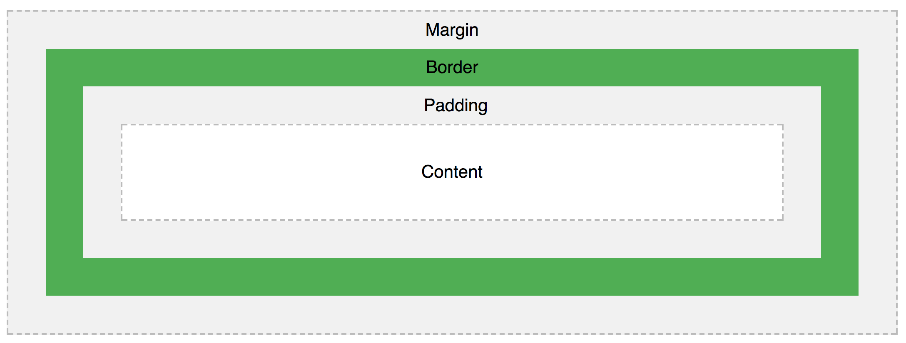

# CSS (Cascade style sheets)
Permite controlar la visualización de una página web.

## Definición de estilos
* Embebido ``` <style> body { text-align: center; }  </style> ```
* Inline ``` <p style="color: green;"> Content </p> ```
* Hojas externas ```<link href="./styles.css">```

*Demo: incluir estilos*

## Estructura


## [Selectores](https://developer.mozilla.org/en-US/docs/Web/CSS/CSS_Selectors)
* Type
* Class
* ID
* Universal
* Attribute

### Agrupación
* Adjacent sibling combinator ``` div + aside { color: red; } ```
* Child combinator ``` aside > div ```
* Descendant combinator
* Pseudo-classes
* Pseudo-elements

*Demo: css*

## [Modelo de caja](https://developer.mozilla.org/en-US/docs/Web/CSS/CSS_Box_Model)
All HTML elements can be considered as boxes. In CSS, the term "box model" is used when talking about design and layout.



*Práctica: crear una regla para estilizar un elemento con las diferentes propiedades del modelo de caja*

## Fuentes
* Texto
* Unidades de medida

## [Transformaciones](https://www.w3schools.com/cssref/css3_pr_transform.asp)

* scale
* skew
* rotate
* translate
* matrix
* perspective

## [Preprocesadores](https://htmlmag.com/article/an-introduction-to-css-preprocessors-sass-less-stylus)
Pre-processors extend CSS with variables, operators, interpolations, functions, mixins and many more other usable assets

¿Por qué usar un pre procesador?
* Reusabilidad
* Mantenibilidad
* Legibilidad
* Variables
* Functions
* Iterators
* Increase productivity

Ejemplos de preprocesadores
* [Sass](http://sass-lang.com/)
* [Less](http://lesscss.org/)
* [Stylus](http://stylus-lang.com/)

*Demo: Talentry styles*

## CSS en JavaScript
* [React inline styles](https://zhenyong.github.io/react/tips/inline-styles.html)

## [Responsive design](https://developers.google.com/web/fundamentals/design-and-ux/responsive/?hl=es) / [Mobile first](https://www.uxpin.com/studio/blog/a-hands-on-guide-to-mobile-first-design/)

## Arquitectura CSS
Objetivos de establecer una arquitectura CSS
* Estilos modulares
* Legibles
* Claridad en la implementación
* Evitar conflictos

Ejemplo de arquitecturas CSS
* [BEM (Block element modifier)](http://getbem.com/introduction/)