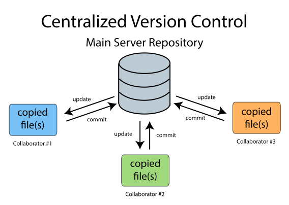
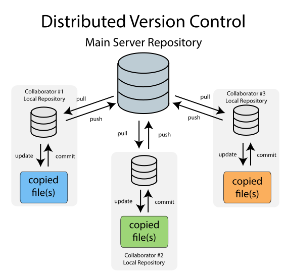
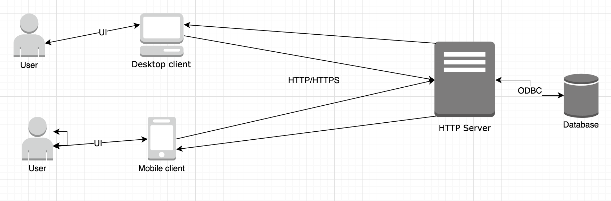

# Primeros pasos

## Básicas al hacer código
* Indentar
* Nombrado
* Comentarios
* Single responsability
* DRY
* KISS

[Bad code](../examples/bad_code.js)
[Acceptable code](../examples/acceptable_code.js)

## [Sistemas de control de versiones](https://www.atlassian.com/git/tutorials/what-is-version-control)

Sistema que registra los cambios realizados sobre un archivo o conjunto de archivos a lo largo del tiempo

* Centralizado


* Distribuido


### ¿Por qué debería utilizar uno?
* Planeación de liberaciones
* Manejo de varias versiones a la vez
* Seguimiento de tareas y errores
* Trabajo en equipo
* Referencia
* Copias de seguridad

### [Git](https://git-scm.com/)
Git is a free and open source distributed version control system designed to handle everything from small to very large projects with speed and efficiency

_[Try git](https://try.github.io/)_ 

### Comandos básicos

* ``` git clone ```
* ``` git status ```
* ``` git add ```
* ``` git commit  ```
* ``` git branch ```
* ``` git checkout ```
* ``` git merge ```
* ``` git pull ```
* ``` git push ```

```
// Install github for desktop

git clone https://github.com/Tesselar/tesselar-web-practice.git

// Create index.html

git add index.html

git status

git commit -m "feat Create main page"

// Create repository in Github for desktop

```

## Metodologías de desarrollo de software
* Waterfall
* Prototype oriented
* [Agile](https://www.youtube.com/watch?v=XU0llRltyFM)
* Extreme programming
* Test-driven development

**Demo agile environment**

## Entornos de desarrollo integrados y editores de texto

El propósito de utilizar un entorno de desarrollo integrado es elevar la productividad, disminuir el factor de error humano y eliminar las tareas repetitivas

IDEs y Editores de texto:
* Visual Studio
* Netbeans
* Eclipse
* Sublime text
* Code
* Atom
* Vi
* Web storm

### [VS Code](https://code.visualstudio.com/)
* Intellisense
* Debugging
* Built-in Git
* Extensions

**Demo temas, pluggins, terminal y git desde VS Code**

## HTTP (Hypertext Transfer Protocol)
Protocolo de transferencia donde se puede enviar información entre diferentes servicios y clientes.



### Anatomía de una petición HTTP
* Headers
* Body

### Common methods
* POST
* PUT
* DELETE
* GET
* PATCH

### [Status codes](https://httpstatuses.com/)
* 1xx Information
* 3xx Redirection
* 4xx Client error
* 5xx Server error

**Demos HTTP**
* _Petición HTTP desde [Postman](https://www.getpostman.com/)_
* _Petición desde Chrome_
* _Petición desde Firefox_

[GitHub API](https://developer.github.com/v3/)
